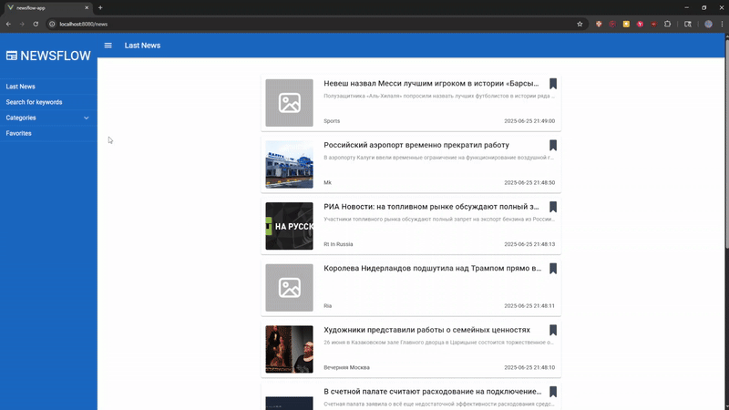

# NewsFlow-App
Проект представляет собой веб-приложение агрегатор новостей c использованием Vue 3, TypeScript и NEWSDATA.IO API.

[**_<ins>Ссылка на приложение</ins>_**](https://newsflow-app.vercel.app/news)

## 🚀 Демо 
*Пример работы приложения* 
  

## 🛠 Технологии  
- **Frontend**: Vue 3, TypeScript, Vuetify, Vuex, Webpack, Vue CLI, Vue Router
- **Backend**: API https://newsdata.io/
- **Deploy**: Vercel  

## ⚡️ Функционал 
✅ Просмотр последних новостей

✅ Просмотр новостей по категориям

✅ Просмотр конкретной новостной статьи

✅ Поиск новостей по ключевым словам

✅ Сохранение новостей в LocalStorage

✅ Адаптивный интерфейс

## 🚀 Установка  
### Cоздать .env файл по примеру .env.example который есть в структуре проекта и внести туда api key из https://newsdata.io/
```bash
git clone https://github.com/chocopie777/newsflow-app.git

npm install

npm run serve